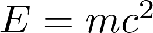
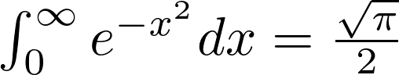

# pictex

## Description

pictex is a command-line tool that renders LaTeX mathematical expressions as PNG images,
using `pdflatex` and `dvipng` under the hood.

## Usage

```
Usage: pictex [OPTIONS] <expression>

Arguments:
  <expression>  LaTeX math expression

Options:
  -o, --output <file>           specify the output file for the image
  -D, --output-directory <dir>  specify the output directory for the generated files [default: /tmp]
  -d, --dpi <num>               set the output resolution [default: 500]
  -q                            Suppress normal output; errors are still displayed
  -h, --help                    Print help
  -V, --version                 Print version
```

### Examples

```bash
$ pictex "E = mc^2"
```



```bash
$ pictex "\\int_0^\\infty e^{-x^2} dx = \\frac{\\sqrt{\\pi}}{2}"
```



## Requirements

- `pdflatex` - LaTeX compiler
- `dvipng` - DVI to PNG converter