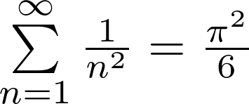

# pictex

## Description

pictex is a command-line tool that renders LaTeX mathematical expressions as PNG images,
using `pdflatex` and `dvipng` under the hood.

## Usage

```
Usage: pictex [OPTIONS] <expression>

Arguments:
  <expression>  LaTeX math expression

Options:
  -o, --output <file>  specify the output file for the image
  -d, --dpi <num>      set the output resolution [default: 500]
  -v, --verbose        print detailed progress information
  -h, --help           Print help
  -V, --version        Print version
```

### Examples

```bash
$ pictex "E = mc^2"
```


```bash
$ pictex "\sum\limits_{n=1}^{\infty} \frac{1}{n^2} = \frac{\pi^2}{6}"
```



## Requirements

- `pdflatex` - LaTeX compiler
- `dvipng` - DVI to PNG converter
